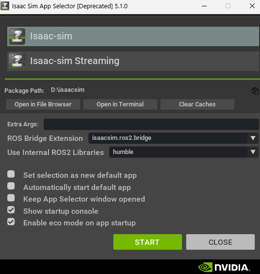

# 🛠️ Environment Setup & Installation Guide

This document outlines the steps for setting up **NVIDIA Isaac Sim (v5.1.0)**. It focuses on the **Workstation** installation method, which offers the best performance for local development, especially on hardware with limited VRAM.

## 1. System Requirements & Compatibility

Before downloading, verify your hardware. Isaac Sim is GPU-intensive.
* **Official Requirements:** [NVIDIA Docs - System Requirements](https://docs.isaacsim.omniverse.nvidia.com/5.1.0/installation/requirements.html)
* **Operating System:** Ubuntu 20.04/22.04 (Recommended) or Windows 10/11.

> **💡 Low-Spec Tip:** If your machine is slightly below the minimum specs (e.g., 6GB-8GB VRAM), use **Linux**. Windows consumes ~1.5GB VRAM just for the desktop manager, whereas Linux is much more lightweight, leaving more room for the simulation.

### 2. Pre-Installation Check
After downloading the [Isaac Sim](https://docs.isaacsim.omniverse.nvidia.com/5.1.0/installation/download.html), run the **Compatibility Checker** to ensure your drivers and GPU are ready.
* [How to run Compatibility Checker](https://docs.isaacsim.omniverse.nvidia.com/5.1.0/installation/install_workstation.html#isaac-sim-compatibility-checker)

## 3. Choosing the Installation Method

We have three deployment options. For this handbook, we use **Workstation**.

| Method | Best For | Pros | Cons |
| :--- | :--- | :--- | :--- |
| **💻 Workstation** (Recommended) | Local development, Debugging, GUI use. | Best performance (native); easiest setup. | Tied to one machine. |
| **🐳 Docker** | CI/CD pipelines, Headless training. | Isolated environment; reproducible. | **Performance overhead** on Windows/WSL; complex GUI setup (X11 forwarding). |
| **☁️ Cloud** | Systems without GPUs (MacBooks, Ultrabooks). | No local hardware needed; accessible anywhere. | Expensive (AWS/Azure costs); requires high-speed internet for streaming. |

* **Workstation Guide:** [NVIDIA Docs](https://docs.isaacsim.omniverse.nvidia.com/5.1.0/installation/install_workstation.html)
* **Docker Guide:** [NVIDIA Docs](https://docs.isaacsim.omniverse.nvidia.com/5.1.0/installation/install_container.html)
* **Cloud Guide:** [NVIDIA Docs](https://docs.isaacsim.omniverse.nvidia.com/5.1.0/installation/install_cloud.html)

## 4. Dependency Setup (Python & ROS 2)

### 🐍 Python Setup
Isaac Sim comes with an internal Python environment, but for external scripting, ensure you have Python installed.
* **Requirement:** Python 3.11.
* [Python Installation Guide](https://docs.isaacsim.omniverse.nvidia.com/5.1.0/installation/install_python.html)

### 🤖 ROS 2 Setup
To communicate with the robot, we need the ROS 2 Bridge.
* **Linux:** Install ROS 2 **Humble** (Ubuntu 22.04) or **Jazzy** (Ubuntu 24.04).
* **Windows:** Do **not** install ROS on native Windows. You must use **WSL2** (Windows Subsystem for Linux).
    * Install Ubuntu 22.04 distro inside WSL.
    * Follow the [ROS 2 Installation Guide](https://docs.isaacsim.omniverse.nvidia.com/5.1.0/installation/install_ros.html).

## 5. Installation Steps (Workstation)

1.  **Guide:** [NVIDIA Docs](https://docs.isaacsim.omniverse.nvidia.com/5.1.0/installation/install_workstation.html#isaac-sim-short-install-and-launch)

## 6. First Launch Configuration 🚀

This is an important step to ensure the simulator talks to ROS 2 correctly. Locate the isaac-sim.selector and run the file. The **App Selector** window will appear. Configure it as follows:

| Setting | Value | Why? |
| :--- | :--- | :--- |
| **App Selector** | `Isaac Sim` (or `Isaac Sim Full`) | Loads the standard GUI. |
| **Extra Args** | `--/isaac/startup/ros_bridge_extension=isaacsim.ros2.bridge` | Auto-loads the ROS 2 Bridge extension on startup. |
| **Internal ROS Libraries** | `humble` (or your installed version) | Tells Isaac Sim which ROS version libraries to link against. |

3.  Click **START**.

> **Note:** The first launch may take several minutes as shaders compile.

### Verification
Once opened, go to `Window` -> `Extensions` and search for `ros2_bridge`. It should be enabled (green checkmark).